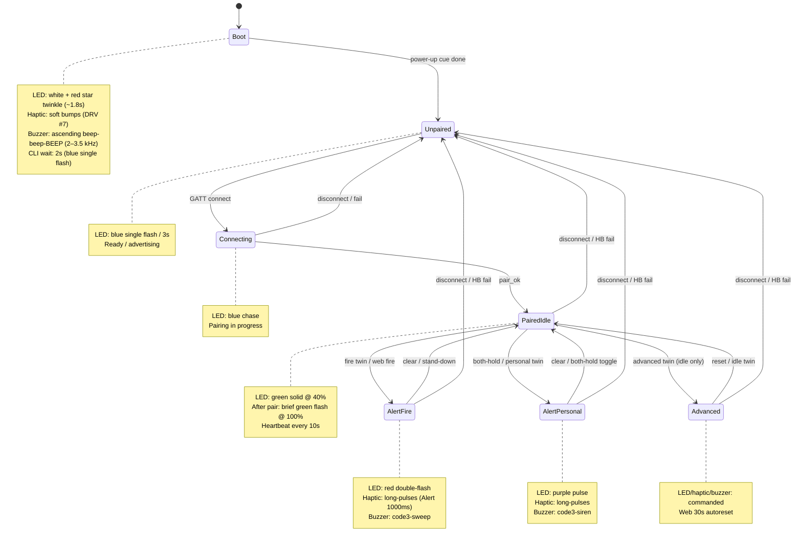
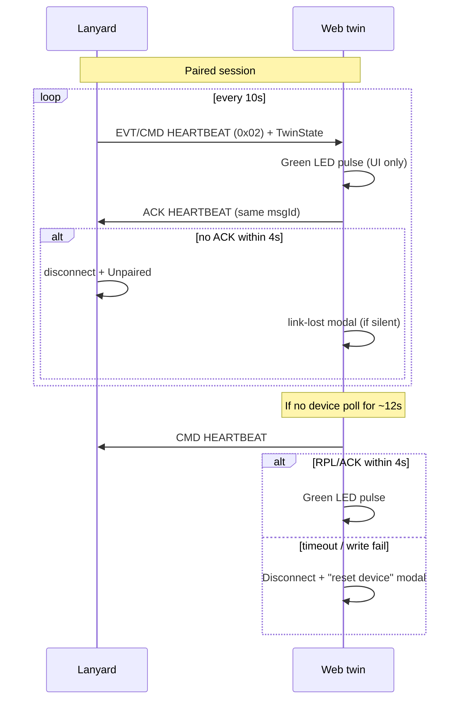

# Link & indication state machine

How the lanyard and web twin move between link states, what the LEDs / actuators show, and which events drive each transition.

## Overview

## Link states (device)

| State | How entered | LED indication | Other actuators | Exit events |
|-------|-------------|----------------|-----------------|-------------|
| **Boot** | Power-on / reset | White + red star twinkle (~1.8s); CLI wait uses blue single flash | Soft haptic bumps + ascending beep-beep-BEEP (2–3.5 kHz) | Cue done → Unpaired |
| **Unpaired** | Boot done, disconnect, heartbeat fail | Blue `FLASH_SINGLE_3S` | Off (stand-down clears alerts) | GATT connect → Connecting |
| **Connecting** | BLE GAP connect (not yet paired) | Blue chase | Off | `pair_ok` → PairedIdle; disconnect → Unpaired |
| **PairedIdle** | Successful pair / alert clear | Green solid @ 40% (pair flash @ 100% first) | Off | Twin CMD, both-hold, disconnect, HB fail |
| **AlertFire** | Twin fire / web fire | Red double-flash @ 100% | Long-pulses haptic, code3-sweep buzzer | Clear → PairedIdle; disconnect/HB fail → Unpaired |
| **AlertPersonal** | Both-hold / twin personal | Purple pulse @ 100% | Long-pulses haptic, code3-siren | Clear / both-hold toggle → PairedIdle; disconnect/HB fail → Unpaired |
| **Advanced** | Twin with advanced flag while idle | Commanded LED pattern/color/brightness | Commanded haptic/buzzer | Idle twin / autoreset; disconnect/HB fail → Unpaired |

Stand-down on disconnect / heartbeat failure always: stop buzzer + haptics, clear alert to idle twin, set **Unpaired** blue flash, republish status.

## Heartbeat / poll

| Side | Interval | Timeout | On failure |
|------|----------|---------|------------|
| **Device** | Poll every **10s** after pair | **4s** waiting for ACK | `ble_gap_terminate` → Unpaired (blue flash), clear indications |
| **Web** | Expect device poll; fallback poll after **~12s** silence | **4s** for reply | Disconnect GATT, show link-lost modal (“reset the lanyard”) |
| **Web UI** | On any successful heartbeat (device poll or web-poll reply) | — | Brief green LED pulse on virtual lanyard (no device LED change) |

## Other events

| Event | Source | Effect |
|-------|--------|--------|
| Side button short press (L/R) | Device | EVT `0x10` button cue → web purple side-button flash (~280ms) |
| Both buttons hold | Device | Raise / clear personal alert + twin EVT |
| Twin state CMD | Web | Apply if mutual-exclusion / alert rules allow; ACK or NAK |
| Twin state EVT | Device | Web mirrors state (skip outbound echo) |
| Unpair (`0x03`) | Web | Clear session; device unpaired |

## Indication cheat-sheet

| Cue | Color | Pattern | When |
|-----|-------|---------|------|
| Ready | Blue | Single flash / 3s | Unpaired |
| Pairing | Blue | Chase | GATT connected, awaiting pair |
| Pair success | Green | Solid flash ~450ms @ 100% | `pair_ok` |
| Idle linked | Green | Solid @ 40% | Paired, no alert |
| Fire | Red | Double flash | Fire alert |
| Personal | Purple | Pulse | Personal alert |
| Web heartbeat | Green | Brief brightness pulse | UI only, on poll RX |

See also: [PACKET_PROTOCOL.md](PACKET_PROTOCOL.md), [PAIRING.md](PAIRING.md), [BLE_GATT.md](BLE_GATT.md).
